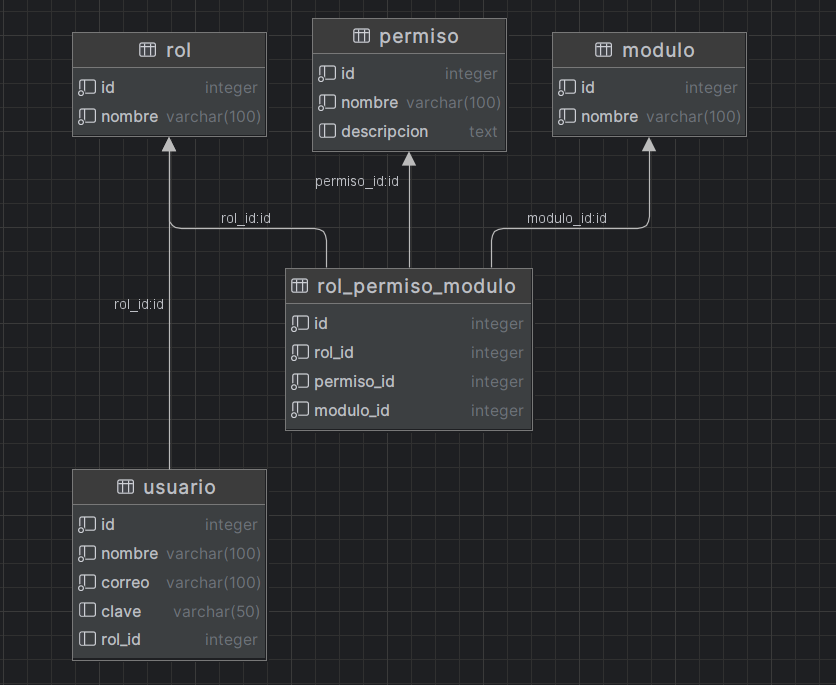

# README

Este README proporciona instrucciones detalladas para configurar y trabajar con una base de datos PostgreSQL en un proyecto de ASP.NET Core API, utilizando Entity Framework Core como ORM.

## Paso 1: Bosquejos de primeras pantallas y diagrama entiedad relaciòn

Antes de comenzar, es importante diseñar la estructura de la base de datos. Asegúrese de tener un diseño claro de las tablas y relaciones necesarias para su aplicación.





## Paso 2: Crear Rol de Usuario y Asignarlo a la Base de Datos
Desde el command line interface del motor del Postgres


Primero, creamos un rol de usuario en PostgreSQL y lo asignamos a la base de datos. Por ejemplo:

```sql
CREATE USER robert WITH SUPERUSER LOGIN PASSWORD 'root';
```

## Paso 3: Crear la Base de Datos en PostgreSQL

Utilizamos el siguiente comando para crear la base de datos en PostgreSQL:

```sql
CREATE DATABASE contrato_db WITH OWNER robert TEMPLATE template0;
```

## Paso 4: Usando datsagrip el gestor de base de datos se es posible respaturrar y exportar.

En caso de tener un respaldo de la base de datos, podemos importarlo para restaurar los datos.


es necesario setear las herramientas que podras encontrar en C:\Program Files\PostgreSQL\16\bin, por defecto.


## Paso 5: Crear un Proyecto ASP.NET Core API

Instale Microsoft Visual Studio y seleccione las herramientas de ASP.NET Web para crear un proyecto del tipo ASP.NET Core API.

## Paso 6: Instalar Entity Framework y Npgsql

Instale las siguientes dependencias de NuGet para trabajar con Entity Framework Core y PostgreSQL:

- `Microsoft.EntityFrameworkCore.Tools`
- `Npgsql.EntityFrameworkCore.PostgreSQL`

## Paso 7: Generar los Modelos desde la Base de Datos

Utilizamos el comando Scaffold-DbContext para generar los modelos a partir de la base de datos:

```bash
Scaffold-DbContext "Host=localhost;Database=contrato_db;Username=robert;Password=root;Encrypt=False" Npgsql.EntityFrameworkCore.PostgreSQL -OutputDir Models
```

## Paso 8: Configurar la Cadena de Conexión

Mueva la cadena de conexión generada en `ContratoDbContext.cs` y asegúrese de mantener la información sensible fuera del código fuente.

## Paso 9: Configurar la Cadena de Conexión en appsettings.json

Agregue la cadena de conexión en `appsettings.json` como sigue:

```json
{
  "ConnectionStrings": {
    "cadenaSql": "Host=localhost;Database=contrato_db;Username=robert;Password=root"
  },
  "Logging": {
    "LogLevel": {
      "Default": "Information",
      "Microsoft.AspNetCore": "Warning"
    }
  },
  "AllowedHosts": "*"
}
```

## Paso 10: Configurar el Contexto en Program.cs

Agregue el contexto creado en `Program.cs` de la siguiente manera:

```csharp
builder.Services.AddDbContext<ContratoDbContext>(options => options.UseNpgsql(builder.Configuration.GetConnectionString("cadenaSql")));
```

## Paso 11: Agregar un Controlador Vacío

Agregue un controlador vacío en su proyecto para interactuar con la base de datos según sea necesario.

¡Listo! Ahora su proyecto ASP.NET Core API está configurado para trabajar con la base de datos PostgreSQL utilizando Entity Framework Core. Si tiene alguna pregunta o necesita más ayuda, no dude en consultar la documentación oficial de ASP.NET Core y Entity Framework Core.
