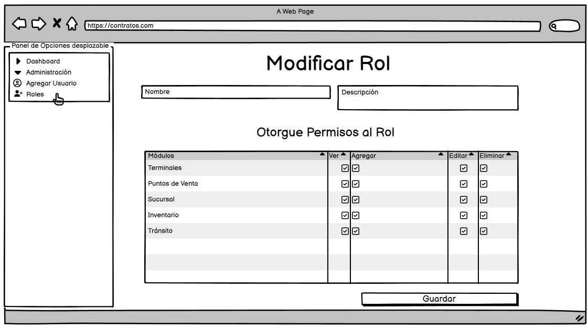
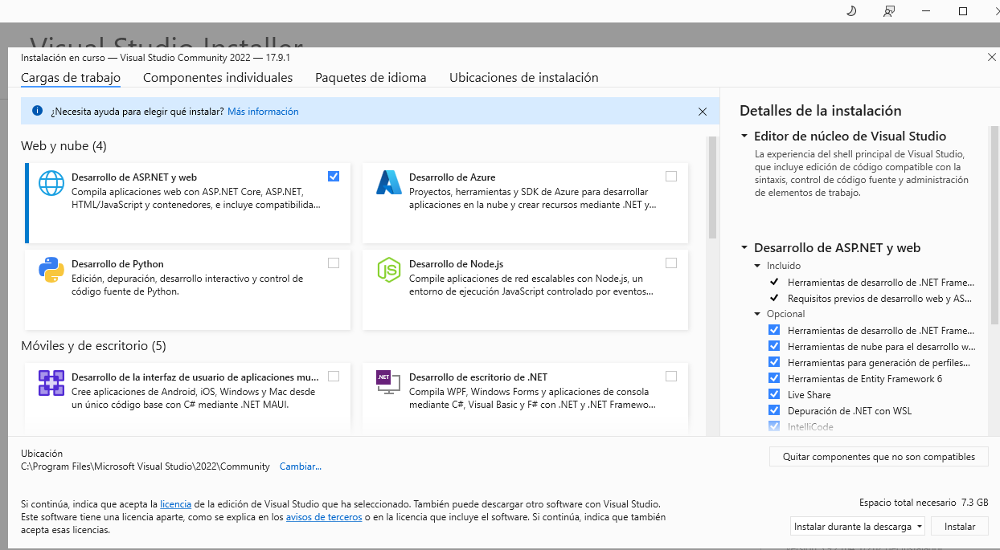

# README

Este README proporciona instrucciones detalladas para configurar y trabajar con una base de datos PostgreSQL en un proyecto de ASP.NET Core API, utilizando Entity Framework Core como ORM.

## Contenido

1. [Bosquejos de primeras pantallas y diagrama entidad-relación](#paso-1-bosquejos-de-primeras-pantallas-y-diagrama-entidad-relación)
2. [Crear Rol de Usuario y Asignarlo a la Base de Datos](#paso-2-crear-rol-de-usuario-y-asignarlo-a-la-base-de-datos)
3. [Crear la Base de Datos en PostgreSQL](#paso-3-crear-la-base-de-datos-en-postgresql)
4. [Usar DBeaver para respaldar y restaurar la base de datos](#paso-4-usar-dbeaver-para-respaldar-y-restaurar-la-base-de-datos)
5. [Crear un Proyecto ASP.NET Core API](#paso-5-crear-un-proyecto-aspnet-core-api)
6. [Instalar Entity Framework y Npgsql](#paso-6-instalar-entity-framework-y-npgsql)
7. [Generar los Modelos desde la Base de Datos](#paso-7-generar-los-modelos-desde-la-base-de-datos)
8. [Configurar la Cadena de Conexión](#paso-8-configurar-la-cadena-de-conexión)
9. [Configurar la Cadena de Conexión en appsettings.json](#paso-9-configurar-la-cadena-de-conexión-en-appsettingsjson)
10. [Configurar el Contexto en Program.cs](#paso-10-configurar-el-contexto-en-programcs)
11. [Agregar un Controlador Vacío](#paso-11-agregar-un-controlador-vacío)
12. [Testeando la API](#testeand-la-api)
13. [Referencias de programas](#testeand-la-api)
- [Tecnologías](#tecnologías)
## Paso 1: Bosquejos de primeras pantallas y diagrama entidad relación.

Antes de comenzar, es importante diseñar la estructura de la base de datos. Asegúrese de tener un diseño claro de las tablas y relaciones necesarias para su aplicación.





## Paso 2: Crear Rol de Usuario y Asignarlo a la Base de Datos
Desde el command line interface del motor del Postgres


Primero, creamos un rol de usuario en PostgreSQL y lo asignamos a la base de datos. Por ejemplo:

```sql
CREATE USER robert WITH SUPERUSER LOGIN PASSWORD 'root';
```

## Paso 3: Crear la Base de Datos en PostgreSQL

Utilizamos el siguiente comando para crear la base de datos en PostgreSQL:

```sql
CREATE DATABASE contrato_db WITH OWNER robert TEMPLATE template0;
```

```sql
CREATE TABLE public.modulo (
    id integer NOT NULL,
    nombre character varying(100) NOT NULL
);

CREATE TABLE public.permiso (
    id integer NOT NULL,
    nombre character varying(100) NOT NULL,
    descripcion text
);

CREATE TABLE public.rol (
    id integer NOT NULL,
    nombre character varying(100) NOT NULL
);

CREATE TABLE public.rol_permiso_modulo (
    id integer NOT NULL,
    rol_id integer NOT NULL,
    permiso_id integer NOT NULL,
    modulo_id integer NOT NULL
);

CREATE TABLE public.usuario (
    id integer NOT NULL,
    nombre character varying(100) NOT NULL,
    correo character varying(100) NOT NULL,
    clave character varying(50),
    rol_id integer
);
```

## Paso 4: Usando Datagrip el gestor de base de datos, se es posible restaurar y exportar.

En caso de tener un respaldo de la base de datos, podemos importarlo para restaurar los datos.


Es necesario establecer las herramientas que podrás encontrar en C:\Program Files\PostgreSQL\16\bin, por defecto.


## Paso 5: Crear un Proyecto ASP.NET Core API

Instale Microsoft Visual Studio y seleccione las herramientas de ASP.NET Web para crear un proyecto del tipo ASP.NET Core API.


Recuerda habilitar para este caso la compatibilidad con controladores, ya que no será una mínima API.


## Paso 6: Instalar Entity Framework y Npgsql

Instale las siguientes dependencias de NuGet para trabajar con Entity Framework Core, PostgreSQL y JWt para considerar los temas de seguridad mientras madura el proyecto:

- `Microsoft.EntityFrameworkCore.Tools`
- `Npgsql.EntityFrameworkCore.PostgreSQL`
- `Microsoft.AspNetCore.Authentication.JwtBearer`

Puedes realizarlo desde Nutget package manager o desde la consola.


```dotnet
  dotnet add package nombre_paquete --version 8.0.2
```

## Paso 7: Generar los Modelos desde la Base de Datos

Utilizamos el comando Scaffold-DbContext para generar los modelos a partir de la base de datos:

```bash
Scaffold-DbContext "Host=localhost;Database=contrato_db;Username=robert;Password=root;Encrypt=False" Npgsql.EntityFrameworkCore.PostgreSQL -OutputDir Models
```


## Paso 8: Configurar la Cadena de Conexión

Mueva la cadena de conexión generada en `ContratoDbContext.cs` y asegúrese de mantener la información sensible fuera del código fuente.

## Paso 9: Configurar la Cadena de Conexión en appsettings.json

Agregue la cadena de conexión en `appsettings.json` como sigue:

```json
{
  "ConnectionStrings": {
    "cadenaSql": "Host=localhost;Database=contrato_db;Username=robert;Password=root"
  },
  "Logging": {
    "LogLevel": {
      "Default": "Information",
      "Microsoft.AspNetCore": "Warning"
    }
  },
  "AllowedHosts": "*"
}
```

## Paso 10: Configurar el Contexto en Program.cs

Así debe quedar la configuración en `Program.cs` de la siguiente manera:

Program.cs
```csharp
using Microsoft.AspNetCore.Authentication.JwtBearer;
using Microsoft.EntityFrameworkCore;
using Microsoft.IdentityModel.Tokens;
using System.Text;
using WebContratos.Controllers;
using WebContratos.Models;

var builder = WebApplication.CreateBuilder(args);

// Add services to the container.

builder.Services.AddControllers();
// Learn more about configuring Swagger/OpenAPI at https://aka.ms/aspnetcore/swashbuckle
builder.Services.AddEndpointsApiExplorer();
builder.Services.AddSwaggerGen();
builder.Services.AddDbContext<ContratoDbContext>(options => options.UseNpgsql(builder.Configuration.GetConnectionString("cadenaSql")));


//agregar en la documentación la parte 
// Configuración de JWT
var key = Encoding.ASCII.GetBytes("aquí_va_tu_clave_secretaaquí_va_tu_clave_secretaaquí_va_tu_clave_secreta");
builder.Services.AddAuthentication(auth =>
{
    auth.DefaultAuthenticateScheme = JwtBearerDefaults.AuthenticationScheme;
    auth.DefaultChallengeScheme = JwtBearerDefaults.AuthenticationScheme;
})
.AddJwtBearer(options =>
{
    options.RequireHttpsMetadata = false;
    options.SaveToken = true;
    options.TokenValidationParameters = new TokenValidationParameters
    {
        ValidateIssuerSigningKey = true,
        IssuerSigningKey = new SymmetricSecurityKey(key),
        ValidateIssuer = false,
        ValidateAudience = false
    };
});
// Definir políticas de autorización basadas en ámbitos
builder.Services.AddAuthorization(options =>
{
    options.AddPolicy("read:usuarios", policy => policy.RequireClaim("scope", "read:usuarios"));
});
// final JWT
builder.Services.AddControllers();
var app = builder.Build();


// Configure the HTTP request pipeline.
if (app.Environment.IsDevelopment())
{
    app.UseSwagger();
    app.UseSwaggerUI();
}

app.UseHttpsRedirection();

app.UseAuthorization();

app.MapControllers();

app.Run();
```

## Paso 11: Agregar un Controlador Vacío

Agregue un controlador vacío en su proyecto para interactuar con la base de datos según sea necesario.
```csharp
using Microsoft.AspNetCore.Authorization;
using Microsoft.AspNetCore.Mvc;
using Microsoft.EntityFrameworkCore;
using Microsoft.IdentityModel.Tokens;
using System.IdentityModel.Tokens.Jwt;
using System.Security.Claims;
using System.Text;
using WebContratos.Models;

namespace WebContratos.Controllers
{
    [ApiController]
    [Route("[controller]")]
    public class AuthController : ControllerBase
    {       

        private static ContratoDbContext? _contexAuth;
        public AuthController(ContratoDbContext context)
        {
            _contexAuth = context;
        }

        [HttpGet]
        [Route("usuarios")]
        [Authorize("read:usuarios")] // Se requiere el ámbito "read:usuarios"
        public IActionResult GetUsuarios()
        {
            // Lógica para obtener y devolver la lista de usuarios
            return Ok(new { usuarios = ObtenerListaUsuarios() });
        }

        private string[] ObtenerListaUsuarios()
        {
            // Simulación de la obtención de usuarios desde una base de datos u otro origen
            return new string[] { "Usuario1", "Usuario2", "Usuario3" };
        }


        #region inicio sesion
        [HttpPost]
        [Route("login")]
        public IActionResult Login()
        {
            var tokenHandler = new JwtSecurityTokenHandler();
            var key = Encoding.ASCII.GetBytes("aquí_va_tu_clave_secretaaquí_va_tu_clave_secretaaquí_va_tu_clave_secreta");
            var tokenDescriptor = new SecurityTokenDescriptor
            {
                Subject = new ClaimsIdentity(new Claim[]
                {
                new Claim(ClaimTypes.Name, "usuario_de_ejemplo"),
                //new Claim("Scope", "read:usuarios")
                new Claim("Scope", "read:usuariosw")
                }),
                Expires = DateTime.UtcNow.AddHours(1),
                SigningCredentials = new SigningCredentials(new SymmetricSecurityKey(key), SecurityAlgorithms.HmacSha256Signature)
            };
            var token = tokenHandler.CreateToken(tokenDescriptor);
            return Ok(new
            {
                token = tokenHandler.WriteToken(token)
            });
        }

        [HttpGet]
        [Route("auth")]
        [Authorize] // Agregamos el atributo [Authorize] para requerir autorización
        public void Get()
        {
            var rng = new Random();
        }

        //Con este cambio, se requerirá que el cliente proporcione un token de acceso válido
        //(o cualquier otro mecanismo de autorización configurado en tu aplicación) 
        //para poder llamar a este endpoint GET /auth.Si el cliente no proporciona 
        //credenciales válidas, recibirá un código de estado de respuesta 401 Unauthorized.
        #endregion

        [HttpGet]
        [Route("permiso")]
        public async Task<ActionResult<IEnumerable<Permiso>>> GetPermisos()
        {
            return await _contexAuth.Permisos.ToListAsync();
        }

        #region  Seccion modulos solo para prueba

        [HttpGet]
        [Route("GetModulos")]
        //[Route("modulo")]
        public async Task<ActionResult<IEnumerable<Modulo>>> GetModulos()
        {
            return await _contexAuth.Modulos.ToListAsync();
        }
        #endregion

    }
}

```
## Paso 11: Testeando la API
Se puede apreciar cómo se genera el token y se hacen peticiones para validar si tiene permisos, simulando un inicio de sesión.


como puedes observar se traen los datos de la tabla.


# Tecnologías
1. [Balsamiq](https://balsamiq.com/): Herramienta para diseñar bosquejos.
2. [DataGrip](https://www.jetbrains.com/datagrip/): Entorno de desarrollo para bases de datos.
3. [Git](https://git-scm.com/): Sistema de control de versiones distribuido.
4. [Microsoft Visual Studio](https://visualstudio.microsoft.com/es/downloads/): IDE .NET.
5. [PostgreSQL](https://www.postgresql.org/): Motor de base de datos relacional.
6. [PostMan](https://marketplace.visualstudio.com/items?itemName=Postman.postman-for-vscode): Recomiendo esta extensión para Visual Studio Code para testear la API.
7. [ScreenToGift](https://www.screentogif.com/): Herramienta para generar GIF's.
8. [Visual Studio Code](https://code.visualstudio.com/): Para trabajar la parte del Front.
9. [Setear Variable Globales en Postman](https://www.youtube.com/watch?v=im7NZwbTqKY): Para facilitar el uso token en las peticiones solo se puede en la versión escritorio.
10. [Excelente página para verificar como se está generando el token]([https://www.youtube.com/watch?v=im7NZwbTqKY](https://jwt.io/)): validador de token.


¡Listo! Ahora su proyecto ASP.NET Core API está configurado para trabajar con la base de datos PostgreSQL utilizando Entity Framework Core. Si tiene alguna pregunta o necesita más ayuda, no dude en consultar la documentación oficial de ASP.NET Core y Entity Framework Core.
